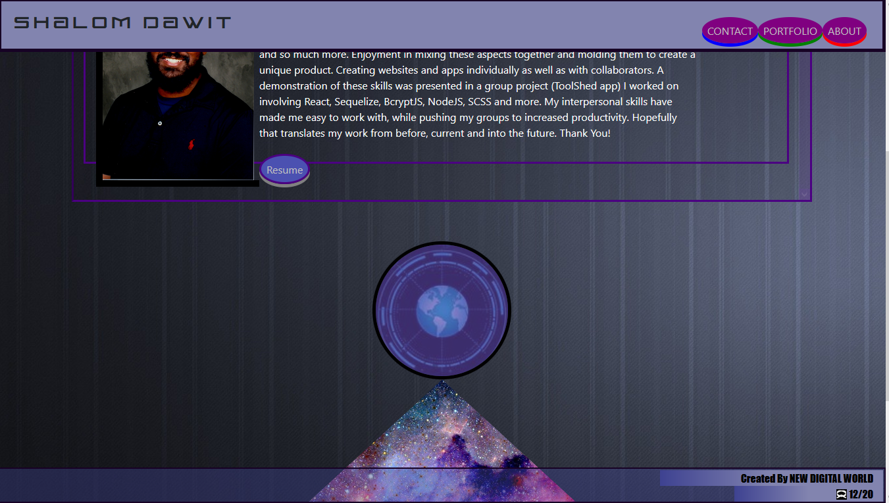

# Portafoglio-react

   

Deployed Portfolio(with backend server functionality): https://portafoglio-react.herokuapp.com 
Deployed BACKUP Portfolio(without backend server functionality): https://mrdawit.github.io/Portafoglio_react/

## Table of contents
- [Description](#Description)
- [Created By](#Created_By)
- [Repository Link](#Repository)

## Description 
My portfolio created using React
   

#### NPM Install, installs the following

## Created By
[MrDawit Shalom Dawit](https://github.com/MrDawit) \
Email: Shalom.Dawit@Gmail.com 

## Repository
[Project Repo](https://github.com/MrDawit/Portafoglio_react)
